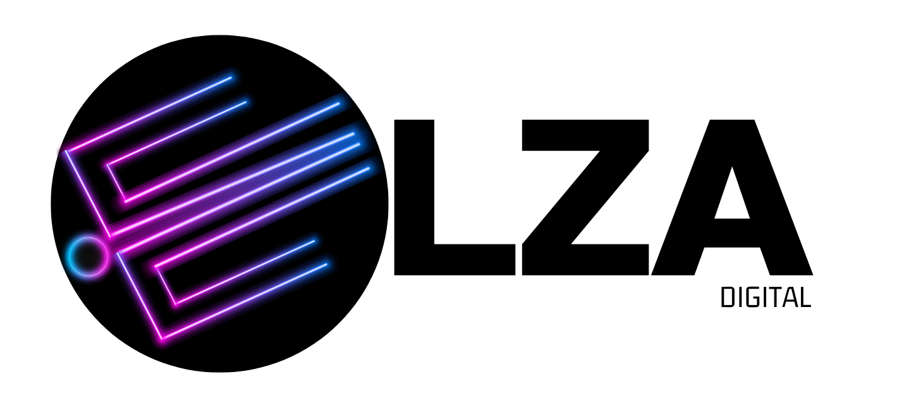

  
  <h1>Bienvenidos a Elza Digital</h1>
  
<i>Innovación, código limpio y soluciones digitales de alto impacto.</i>

  
  

---

## 🌍 Quiénes Somos

En **Elza Digital** construimos productos de software robustos, escalables y centrados en el usuario. Nuestro equipo está compuesto por desarrolladores, diseñadores y estrategas apasionados por la tecnología y las buenas prácticas.

> **Nuestra Misión:** Transformar ideas complejas en ecosistemas digitales accesibles y eficientes.

---

## 📌 Repositorios Destacados

Aquí tienes un vistazo rápido a nuestros proyectos principales y librerías core:

| Proyecto / Repositorio | Descripción | Tecnologías |
| :--- | :--- | :--- |
| 🍓 **[fruiTemplate](https://github.com/Elza-Digital/fruiTemplate)** | Plantilla para empezar a desarrollar proyectos con NestJS. | `NestJS`, `PostgreSQL` |

---

## 📚 Guías y Guidelines (Para nuestro equipo y contribuidores)

Mantenemos un estándar alto en nuestro código. Si vas a colaborar en nuestros repositorios, por favor asegúrate de leer y seguir nuestras guías internas:

* 📖 **[Guía de Estilo y Clean Code](#):** Estándares de TypeScript, nomenclatura de variables y convenciones de arquitectura.
* 🌿 **[Flujo de Trabajo en Git (Git Flow)](#):** Cómo nombrar tus ramas (ej. `feat/`, `fix/`, `chore/`) y nuestra política de commits.
* 🤝 **[Proceso de Pull Requests](./guidelines/CONTRIBUTING.md):** Plantilla obligatoria para PRs, requisitos de code review y aprobación.
* 🛠️ **[Guias](./guides/main.md):** Todo lo que necesitas para levantar el entorno local usando las herramientas requeridas.
* 👁️‍🗨️ **[Repos de Interés](./repos/main.md):** Repositorios que te pueden ayudar a la larga(si hay alguno deprecated: **reportar**).

---

## 💻 Nuestro Stack Tecnológico

  
  
  
  
  
  

 

