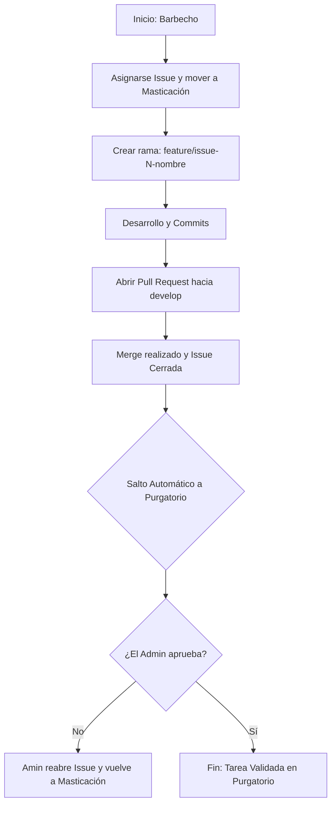

# 📖 Manual de Organización y Flujo de Trabajo

Este documento establece el estándar para que el equipo trabaje sincronizado con el tablero Kanban. El Admin tiene la última palabra en la columna Purgatorio.

---

## 1. Estados del Tablero Kanban

* **Barbecho (To Do):** Tareas pendientes. Nadie las ha asignado todavía.
* **Masticación (In Progress):** Tareas en desarrollo activo por un compañero.
* **Purgatorio (Final Review/QA):** Tarea cerrada que espera la validación final del Líder.
* **Calisto (Merged):** Código que ya ha sido integrado técnicamente en la rama principal.

### 🔄 Diagrama de Flujo del Proceso



## 2. Procedimiento Operativo
Paso 1: Desarrollo
* Elige una Issue en Barbecho(seguramente ya la tengas asignada), asígnatela y muévela a Masticación.

* Crea tu rama local siempre desde la rama `develop` para tener la última versión de código verificada:
```sh
git checkout -b feature/issue-[NÚMERO]-[descripción].
```
Paso 2: Entrega y Cierre Técnico
* Al terminar, abre un Pull Request A LA RAMA `develop`.

* En la descripción del PR(Pull request), escribe obligatoriamente: Fixes #[NÚMERO_DE_ISSUE].

* Cuando el código sea revisado y se haga el Merge, la Issue se cerrará sola.

Paso 3: El Purgatorio (Control del Admin)
IMPORTANTE: Al cerrarse la Issue, la tarjeta saltará automáticamente a **Purgatorio** mediante el Workflow de "Item closed".

Aquí el Admin revisará el resultado final y el cumplimiento de la tarea.

Si hay fallos: El Admin reabrirá la Issue y la tarjeta volverá al ciclo de desarrollo.

Si es correcto: La tarea se considera oficialmente finalizada.

## 3. Estándares Técnicos
* Commits: Mensajes claros que incluyan el número de issue (ej: feat: fix menu zoom #4).

* Pull Requests: Requieren al menos 1 aprobación de un compañero antes del merge.

* Rulesets: Prohibido el push directo a main. Todo cambio entra por PR a develop.

* Conversaciones: Antes del merge, todos los hilos de comentarios deben estar marcados como "Resolved".
